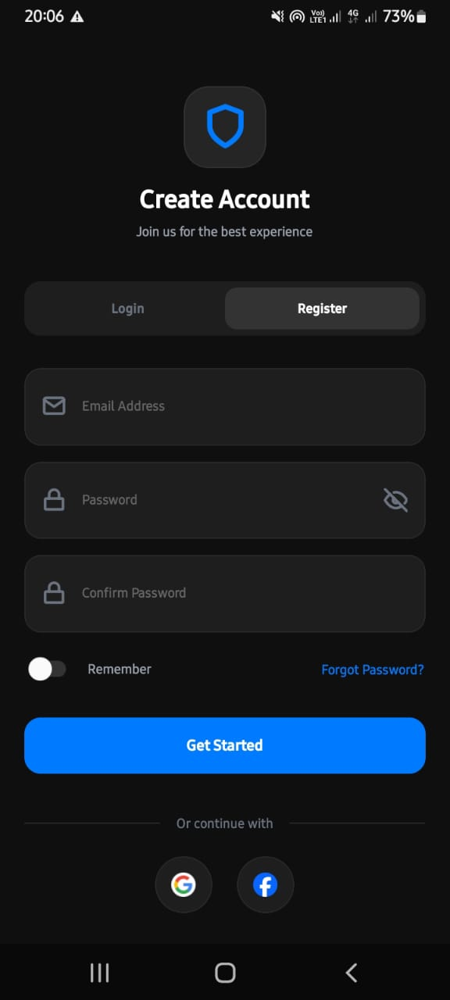
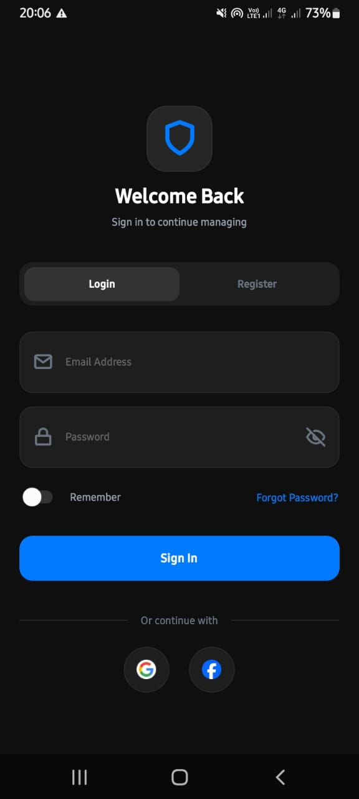
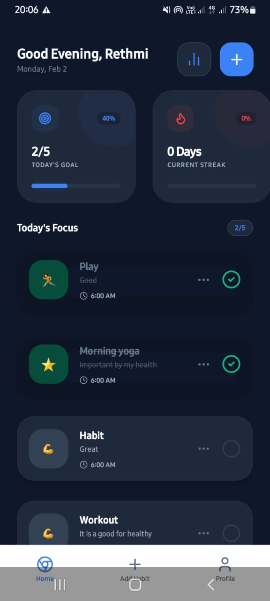
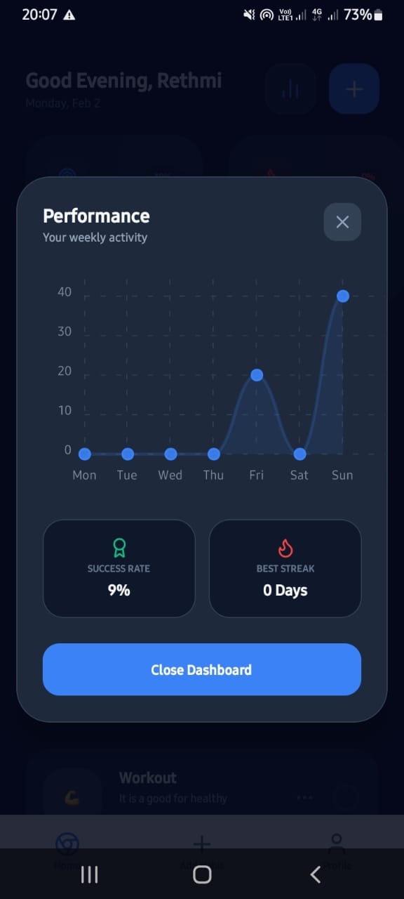
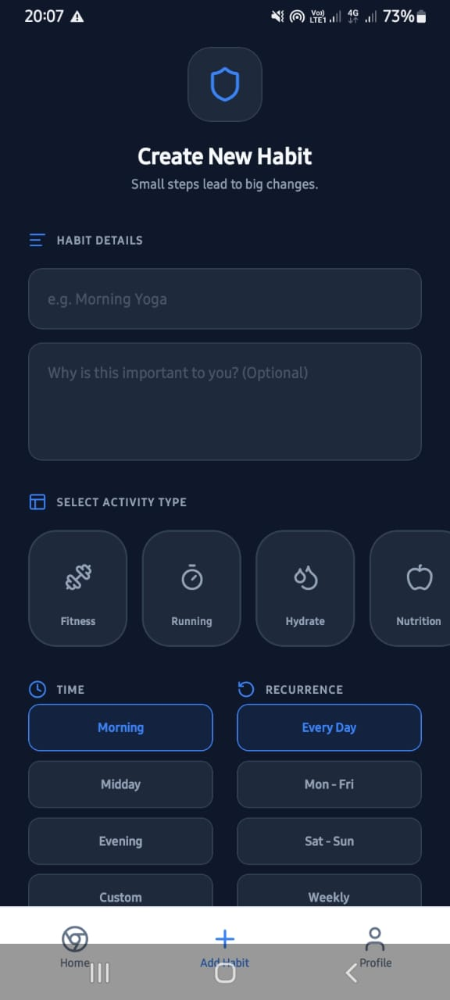
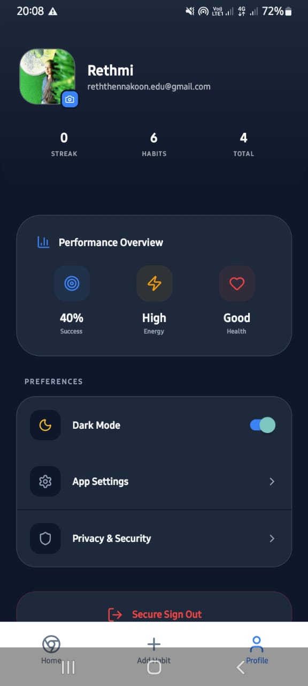
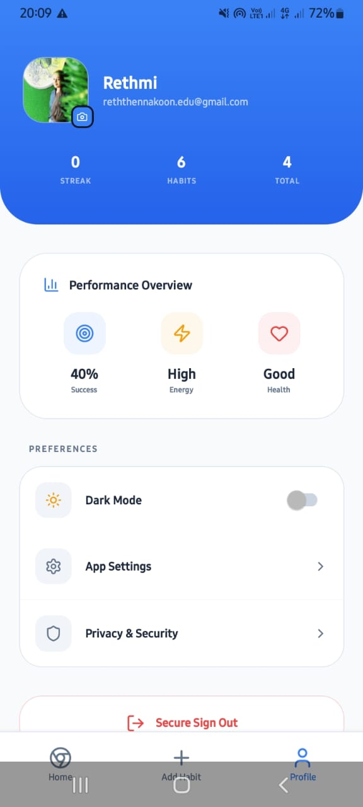

# 🌱 Streakify – Habit Tracker App

Streakify is a modern habit-tracking mobile application developed as part of the Advanced Mobile Development project. The application is designed to support users in building positive habits, reducing negative behavioral patterns, and maintaining long-term consistency. By providing streak-based tracking, insightful analytics, and a clean, intuitive user interface, Streakify enables users to effectively monitor their daily routines and make data-driven improvements to their personal productivity and well-being.

---

## ✨ Key Features

### 🏠 Smart Dashboard

* Time-based personalized greetings
* Real-time habit completion tracking
* Streak counters with visual indicators
* Weekly progress overview
* One-tap habit creation

### 📝 Habit Management

* Flexible scheduling options:

  * 📅 Daily
  * 💼 Weekdays
  * 🎉 Weekends
  * 📈 Weekly goals
* Custom time selection and reminders
* Emoji & icon-based habit identification
* Edit, pause, or update habits anytime

### 📊 Progress & Analytics

* Weekly and monthly progress charts
* Individual habit statistics
* Smart streak calculations
* Achievement milestones
* Performance insights based on user behavior

### 🎨 UI / UX Design

* Minimal and distraction-free interface
* Smooth animations and micro-interactions
* Light & dark mode support
* Responsive layouts for all screen sizes
* Accessibility-friendly design

---


📱 Screenshots


  📝 Register Page




  🔐 Login Page




  🏠 Home Page




  📊 performance chart Page




  ➕ Add Habit Page




  👤 Profile Page




  🌞 LightMode Profile Page




## 🚀 Quick Start Guide

### System Requirements

* Node.js 16.18.0 or higher
* npm or yarn
* Expo CLI (latest)
* Android Emulator / iOS Simulator (optional)

### Installation

```bash
git clone https://github.com/Rethmi/Streakify-MobileApp-AMD_Final_Project-.git
cd streakify
npm install
# or
yarn install
```

### Environment Setup

```bash
cp .env.example .env
```

Update the `.env` file with your Firebase configuration.

### Run the App

```bash
npm start
# or
expo start --tunnel
```

Run on:

* 📱 Expo Go (scan QR)
* 🤖 Android Emulator (`a`)
* 🍎 iOS Simulator (`i`)
* 🌐 Web (`w`)

---

## 📁 Project Structure

```
streakify/
├── app/
│   ├── (tabs)/
│   │   ├── index.tsx        # Dashboard
│   │   ├── add.tsx          # Add Habit
│   │   ├── profile.tsx      # User Profile
│   │   └── _layout.tsx
│   ├── _layout.tsx
│   └── edit-habit.tsx
├── components/
├── services/
├── context/
├── types/
 
```

---

## 🛠 Technology Stack

| Category   | Technology            |
| ---------- | --------------------- |
| Framework  | React Native + Expo   |
| Language   | TypeScript            |
| Navigation | Expo Router           |
| Backend    | Firebase Firestore    |
| State      | React Context + Hooks |
| Styling    | NativeWind            |
| Animations | Reanimated            |

---

## 📊 Data Model (Habit)

```ts
interface Habit {
  id: string;
  title: string;
  description?: string;
  time: string;
  icon: string;
  frequency: 'daily' | 'weekdays' | 'weekends' | 'weekly';
  userId: string;
  createdAt: Timestamp;
  updatedAt: Timestamp;
  isActive: boolean;
  category: string;
  completions: {
    [date: string]: {
      completed: boolean;
      timestamp: Timestamp;
    };
  };
}
```

---

## 🔧 Environment Variables

```env
EXPO_PUBLIC_FIREBASE_API_KEY=your_key
EXPO_PUBLIC_FIREBASE_AUTH_DOMAIN=your_project.firebaseapp.com
EXPO_PUBLIC_FIREBASE_PROJECT_ID=your_project_id
EXPO_PUBLIC_FIREBASE_STORAGE_BUCKET=your_project.appspot.com
EXPO_PUBLIC_FIREBASE_MESSAGING_SENDER_ID=xxxx
EXPO_PUBLIC_FIREBASE_APP_ID=xxxx
```

---

## 🧪 Testing

```bash
npm run test
npm run test:watch
npm run test:coverage
```

---

## 📦 Build (EAS)

```bash
# Android
eas build --platform android --profile production

# iOS
eas build --platform ios --profile production
```


📱 Download the App

Direct Download Link: https://expo.dev/artifacts/eas/ehdpbCYnTWCQE3JKrQH5Ms.apk

---

## 🎓 Academic Context

* **Module:** Advanced Mobile Development
* **Platform:** React Native (Expo)
* **Focus Areas:**

  * Mobile UI/UX
  * Firebase integration
  * State management
  * Performance optimization

---

 
 📚 Learn More
To learn more about the technologies used in this project:

Expo Documentation: https://docs.expo.dev/
React Native: https://reactnative.dev/
Firebase: https://firebase.google.com/docs
Expo Router: https://docs.expo.dev/router/introduction/


## 📞 Support

📧 Email: [reththennakoon.edu@gmail.com] 

---

🌟 *Streakify is built with passion to encourage better habits and consistent personal growth.*


               Made with ❤️ by Sainsa Rethmi Thennakoon
